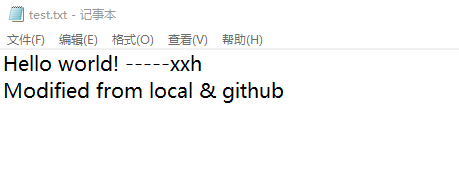

# Git使用练习报告


## 一、创建仓库

首先在Github创建新仓库。


在本地创建文件，列表如下。


其中`.gitignore`用于指定被git忽略的PPT等文件，这些文件不会被git所追踪。文件内容如下。

```
/*.pptx
/*.docx
```

之后在此路径中打开shell，输入命令新建本地git仓库。

```
git init
```

查看目前文件状态。

```
git status
```


两个文件为红色状态，代表文件未追踪。下一步需要使用`add`命令使git追踪这些文件。可以使用：

```git 
git add .\.gitignore .\README.md
```

或

```
git add .
```

（后者用于一次性追踪所有文件。）

`add`完成后所有文件状态显示为绿色。


之后进行提交。

```
git commit
```

系统会弹出默认文件编辑器，在其中编辑提交信息，然后保存关闭。


下一步需要将本地的提交推送至github对应的远程仓库。本示例在github中导入了主机的SSH公钥，方便后续免密推送（这里展示添加后的结果）。


下一步在github中建立远程源，并将本地的仓库推送上去。`-u`命令指定了本地main分支和远程origin分支的配对，后续进行`push`和`pull`等操作时无需指定分支信息。

```
git remote add origin https://github.com/xuxiaohe0308/Git-test.git
git branch -M main
git push -u origin main
```


完成后github上同步了本地仓库。


## 二、上传新文件

本地新建测试文件test.txt。


提交并推送（由于之前已经使用过`-u`参数，所以这里`push`时无需指定其余参数）。


github端新增test.txt文件。


## 三、解决冲突

本示例模拟了一种实际代码管理场景中会出现的冲突。

+ 用户在本地对本地仓库的文件test.txt进行了修改，添加了一行文字`Modified from local`；


+ 与此同时其他用户在他们的本地进行了修改并推送到了远程仓库，修改了远程仓库的内容（添加了一行文字`Modified from github`），本示例直接在github上进行修改来模拟此过程。


上述冲突发生的时候，用户使用`git push`时会提示被拒绝，并建议首先同步远程仓库的内容。


```
git pull
```


提示远程与本地分支有区别，需要合并。使用文本编辑器打开本地文件查看冲突。


冲突解释：

+ <<<<<<<到=======是在当前分支合并之前的文件内容；
+ =======到>>>>>>>是在其它分支下修改的内容。

根据需求人工解决冲突。




可以看到此时的提交、推送等操作可以执行，并且成功地更新了github上的内容。


## 四、版本回退

git提供两种版本回退的方式，分别为：

+ `git reset`，此命令用于移动当前版本指针至之前的某一个版本，**会删除回退版本之后所有版本的记录**；
+ `git revert`，此命令用于还原之前某一版本的修改内容，并生成一个新的提交，**不会删除之前版本的记录，推荐使用此方式**。

假设用户不满意所有对test.txt文件的修改，希望还原到第一次提交test.txt的版本，但同时不能删除这些修改记录，那么他就需要使用版本回退功能。

首先查看历史提交的版本号。

```
git log
```


查看提交信息得知，需要回退到20:44:53 2021 +0800时刻提交的updates test.txt处。

```
git revert <版本号>
```


可以发现，在回退时出现了冲突，这是因为：`revert`命令只会还原一次提交所做出的修改，而默认保留其余提交的修改。在本案例中，由于本次revert期望删除`Modified from local & github`一行，但后续的两次提交（update test from local和solving conflict）其实都是在对此行做出了更改，如果遵从此次revert的意愿就会导致后两次提交的失效。故此场景下需要手动解决冲突。

解决冲突（删掉此行）后add，commit，push，并在github上验证结果。


此时已经完美回退到了需要的版本。